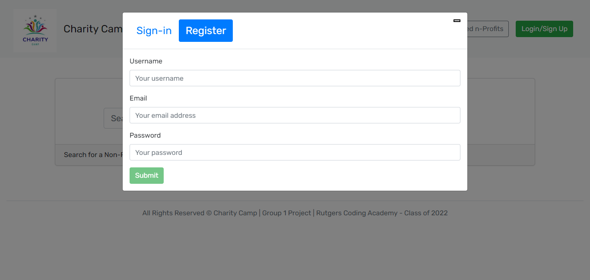
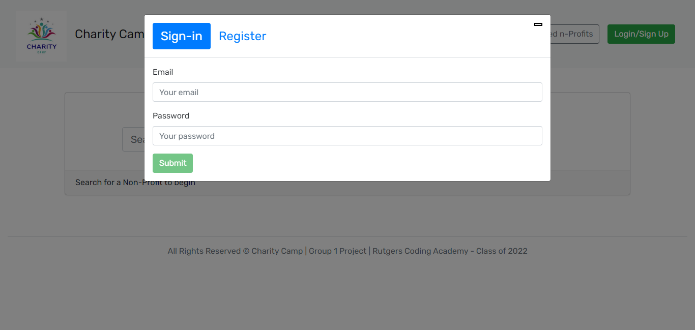

# Charity Camp App

The task is to build an app using MERN stack with a React front end, MongoDB database, and Node.js/Express.js server and API. It's should set up to allow users to save non profit searches to the back end. 

# Technical Specification

Set up an Apollo Server to use GraphQL queries and mutations to fetch and modify data, replacing the existing RESTful API.

Modify the existing authentication middleware so that it works in the context of a GraphQL API.

Create an Apollo Provider so that requests can communicate with an Apollo Server.

##Coding requirements

Use React for the front end.

Use GraphQL with a Node.js and Express.js server.

* Use MongoDB and the Mongoose ODM for the database.

Use queries and mutations for retrieving, adding, updating, and deleting data.

Be deployed using Heroku (with data).

Have a polished UI.

Be responsive.

Be interactive (i.e., accept and respond to user input).

Include authentication (JWT).

Protect sensitive API key information on the server.

Have a clean repository that meets quality coding standards (file structure, naming conventions, best practices for class and id naming conventions, indentation, high-quality comments, etc.).

* Have a high-quality README (with unique name, description, technologies used, screenshot, and link to deployed application).

### Payment Platform

Consider integrating the Stripe payment platform. Even if you don’t create an e-commerce application, you could set up your site to accept charitable donations.

## User Stories

AS AN avid donor

I WANT to search for non profits to donate to

SO THAT I can keep a list of favorite non profits that I donate

## Acceptance Criteria

GIVEN a nonprofit search engine

WHEN I load the search engine

THEN I am presented with a menu with the options Search for non profits and
 Login/Signup and an input field to search for nonprofits and a submit button

WHEN I click on the Search for Non profits menu option

THEN I am presented with an input field to search for nonprofit and a submit button

WHEN I am not logged in and enter a search term in the input field and click the submit button

THEN I am presented with several search results, each featuring a nonprofit’s title, organizer, description, image, set amount goal, 

WHEN I click on the Login/Signup menu option
THEN a modal appears on the screen with a toggle between the option to log in or sign up

WHEN the toggle is set to Signup

THEN I am presented with three inputs for a username, an email address, and a password, and a signup button

WHEN the toggle is set to Login

THEN I am presented with two inputs for an email address and a password and login button

WHEN I enter a valid email address and create a password and click on the signup button

THEN my user account is created and I am logged in to the site

WHEN I enter my account’s email address and password and click on the login button

THEN I the modal closes and I am logged in to the site

WHEN I am logged in to the site

THEN the menu options change to Search for Nonprofits, an option to see my saved non profitss, and Logout

WHEN I am logged in and enter a search term in the input field and click the submit button

THEN I am presented with several search results, each featuring a non profit’s title, organizer, description, image, and set goal amount  and a button to save a nonprofit to my account

WHEN I click on the Save button on a nonprofit

THEN that nonprofits’s information is saved to my account

WHEN I click on the option to see my saved nonprofits

THEN I am presented with all of the nonprofitss I have saved to my account, each featuring the book’s title, author, description, image, and a link to that nonprofit  and a payment button to pay and option to remove nonprofit from my account

WHEN I click on the Remove button on a non profit

THEN that nonprofit is deleted from my saved books list
WHEN I click on the Logout button

THEN I am logged out of the site and presented with a menu with the options Search for Nonprofitss and Login/Signup and an input field to search for nonprofits and a submit button  

### App Screenshots

### App Github Repository Link

https://github.com/Trebligony/charitycamp

### App Heroku Deploy Link

https://charitycamp.herokuapp.com/

## References 

https://stripe.com/docs/api/payment_methods
